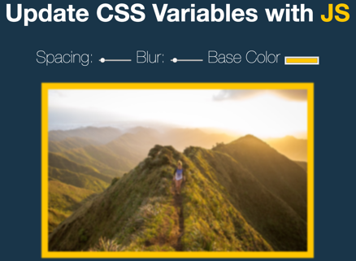

## JavaScript30 Day 3 - Scoped CSS Variables and JS

In this tutorial, we learn how to use CSS Variables and the way JavaScript is used to manipulate CSS Variables.

[View demo site here.](https://webdevtuts.github.io/javascript30_03/)

